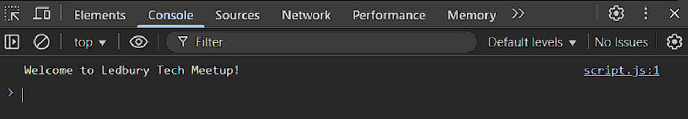

# 01 - Console Log

This page demonstrates the use of `console.log()` in JavaScript to send a message to the browser's developer console.

When the page loads, the message `'Welcome to Ledbury Tech Meetup!'` is printed behind the scenes. This message does not appear on the page itself.

Instead, it is sent to the developer console - a tool built into modern browsers that lets developers inspect and debug their code.

To view the message, open your browser's developer tools (usually by pressing `F12`) and click the "Console" tab.

---

*Screenshot of the developer console in a web browser showing the message printed by `console.log()` when the page loads.*
